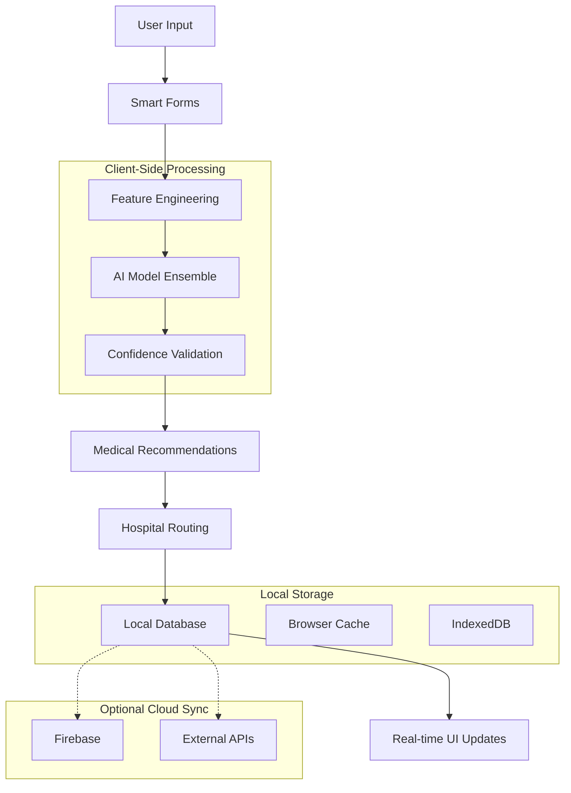

# 🏗️ Technical Architecture - Hackphasia Emergency Health System

## 📋 Architecture Overview

Hackphasia is built using a **local-first, AI-powered architecture** designed for emergency response scenarios where connectivity and resources may be limited. The system combines React-based frontend with client-side AI processing and a flexible backend that can operate both locally and with cloud integration.

## 🎯 Architecture Principles

### 1. **Local-First Design**
- **Immediate Response**: All critical functions work without internet connectivity
- **Data Resilience**: Local storage with intelligent synchronization
- **Performance**: Client-side processing for sub-200ms response times
- **Reliability**: Degraded-mode functionality during network outages

### 2. **Progressive Enhancement**
- **Core Functionality**: Works with basic browser capabilities
- **Enhanced Features**: Additional features with modern browser APIs
- **Mobile-Responsive**: Optimized for mobile devices and tablets
- **PWA-Ready**: Progressive Web App capabilities for offline usage

### 3. **AI-First Approach**
- **Client-Side ML**: TensorFlow.js models running in browser
- **Real-Time Inference**: Immediate health assessment results
- **Ensemble Models**: Multiple specialized AI models for accuracy
- **Confidence Scoring**: Built-in reliability assessment

## 🔄 Data Flow Architecture



## 🗂️ Database Design

### Local Database Schema

#### Hospitals Collection
```typescript
interface Hospital {
  id: string;                    // Unique identifier
  name: string;                  // Hospital name
  location: {
    lat: number;                 // Latitude coordinate
    lng: number;                 // Longitude coordinate
    address: string;             // Full address
    city: string;                // City name
    country: string;             // Country code
  };
  contact: {
    phone: string;               // Emergency contact number
    email?: string;              // Contact email
    website?: string;            // Hospital website
  };
  capacity: {
    beds: number;                // Total bed capacity
    emergencyBeds: number;       // Emergency bed capacity
    staff: number;               // Medical staff count
  };
  services: string[];            // Medical services offered
  adminCredentials: {
    username: string;            // Admin login username
    passwordHash: string;        // Hashed password
  };
  status: 'active' | 'inactive'; // Operational status
  createdAt: Date;              // Record creation timestamp
  updatedAt: Date;              // Last update timestamp
}
```

#### Refugee Tickets Collection
```typescript
interface RefugeeTicket {
  id: string;                    // Unique ticket identifier
  refugeeInfo: {
    name: string;                // Patient name
    age: number;                 // Patient age
    gender: 'male' | 'female';   // Gender
    countryOfOrigin: string;     // Origin country
    languages: string[];         // Spoken languages
    contactInfo?: string;        // Emergency contact
  };
  healthAssessment: {
    symptoms: string[];          // Primary symptoms
    severity: 1 | 2 | 3 | 4 | 5; // Severity rating
    vitalSigns: {
      temperature: number;       // Body temperature
      heartRate: number;         // Heart rate
      bloodPressure: string;     // Blood pressure reading
    };
    medicalHistory: string[];    // Previous medical conditions
    currentMedications: string[]; // Current medications
  };
  aiAnalysis: {
    predictions: {
      condition: string;         // Predicted condition
      probability: number;       // Confidence probability
      severity: string;          // Severity assessment
    }[];
    recommendedActions: string[]; // AI recommendations
    urgencyLevel: 1 | 2 | 3 | 4 | 5; // Urgency priority
    confidenceScore: number;     // Model confidence
  };
  assignedHospital: {
    hospitalId: string;          // Assigned hospital ID
    distance: number;            // Distance in kilometers
    estimatedArrival: Date;      // Estimated arrival time
    transportMethod: string;     // Transportation method
  };
  status: 'pending' | 'assigned' | 'in_transit' | 'arrived' | 'completed';
  createdAt: Date;              // Ticket creation time
  updatedAt: Date;              // Last status update
  location: {
    lat: number;                 // Current location latitude
    lng: number;                 // Current location longitude
  };
}
```

#### Admin Sessions Collection
```typescript
interface AdminSession {
  sessionId: string;             // Unique session identifier
  hospitalId: string;            // Associated hospital ID
  username: string;              // Admin username
  loginTime: Date;               // Session start time
  lastActivity: Date;            // Last activity timestamp
  permissions: string[];         // Access permissions
  isActive: boolean;             // Session status
}
```

## 🧩 Component Architecture

### Frontend Component Hierarchy

```
App
├── Layout
│   ├── Navigation
│   ├── EmergencyContacts
│   └── Footer
├── Pages
│   ├── HomePage
│   │   ├── DashboardStats
│   │   ├── QuickActions
│   │   └── RecentActivity
│   ├── AITriagePage
│   │   ├── SmartRefugeeIntake
│   │   ├── AIAssessmentResults
│   │   └── HospitalRecommendations
│   ├── HospitalManagementPage
│   │   ├── HospitalDashboard
│   │   ├── PatientQueue
│   │   └── ResourceManagement
│   ├── MapPage
│   │   ├── HospitalMap
│   │   ├── ClinicMap
│   │   └── GeolocationService
│   ├── MultilingualPage
│   │   ├── LanguageSelector
│   │   ├── TranslationInterface
│   │   └── VoiceRecognition
│   └── MentalHealthPage
│       ├── TraumaAssessment
│       ├── CopingResources
│       └── CrisisSupport
└── Shared Components
    ├── LoadingSpinner
    ├── ErrorBoundary
    ├── ConfirmationModal
    └── DataVisualization
```

### Service Layer Architecture

```typescript
// Service Layer Structure
services/
├── HospitalDatabase.ts        // Local database management
├── GeolocationService.ts      // Location services
├── AIHealthService.ts         // AI model orchestration
├── VoiceRecognitionService.ts // Speech processing
├── TranslationService.ts      // Language translation
├── CacheService.ts           // Data caching
├── SyncService.ts            // Cloud synchronization
└── NotificationService.ts    // User notifications
```

## 🔧 API Design

### Internal API Endpoints (Local Service Calls)

#### Hospital Management
```typescript
// Hospital CRUD operations
await HospitalDatabase.getAllHospitals()
await HospitalDatabase.getHospitalById(id)
await HospitalDatabase.addHospital(hospital)
await HospitalDatabase.updateHospital(id, updates)
await HospitalDatabase.deleteHospital(id)

// Geolocation services
await GeolocationService.getCurrentLocation()
await GeolocationService.calculateDistance(point1, point2)
await GeolocationService.findNearestHospitals(location, count)
```

#### AI Health Assessment
```typescript
// AI model inference
await AIHealthService.assessPatient(patientData)
await AIHealthService.getConfidenceScore(assessment)
await AIHealthService.recommendActions(predictions)

// Specialized assessments
await MLService.respiratoryAssessment(symptoms)
await MLService.mentalHealthAssessment(psychosocialData)
await MLService.nutritionAssessment(nutritionalData)
```

#### Ticket Management
```typescript
// Refugee ticket operations
await TicketDatabase.createTicket(refugeeData)
await TicketDatabase.getTicketById(ticketId)
await TicketDatabase.updateTicketStatus(ticketId, status)
await TicketDatabase.assignHospital(ticketId, hospitalId)
await TicketDatabase.getTicketsByHospital(hospitalId)
```

### External API Integration (Optional Cloud Features)

#### Firebase Integration
```typescript
// Cloud synchronization
await FirebaseService.syncHospitals()
await FirebaseService.syncTickets()
await FirebaseService.backupData()

// Real-time updates
FirebaseService.onHospitalUpdate(callback)
FirebaseService.onTicketUpdate(callback)
```

#### Translation Services
```typescript
// Language support
await TranslationService.translateText(text, targetLanguage)
await TranslationService.detectLanguage(text)
await TranslationService.getSupportedLanguages()
```

## 🚀 Performance Optimization

### Client-Side Optimizations

1. **Code Splitting**
```typescript
// Lazy loading of components
const AITriagePage = lazy(() => import('./pages/AITriagePage'))
const HospitalManagementPage = lazy(() => import('./pages/HospitalManagementPage'))
```

2. **Data Caching**
```typescript
// Intelligent caching strategy
class CacheService {
  private cache = new Map()
  private readonly TTL = 5 * 60 * 1000 // 5 minutes
  
  set(key: string, data: any) {
    this.cache.set(key, {
      data,
      timestamp: Date.now()
    })
  }
  
  get(key: string) {
    const cached = this.cache.get(key)
    if (cached && Date.now() - cached.timestamp < this.TTL) {
      return cached.data
    }
    this.cache.delete(key)
    return null
  }
}
```

3. **AI Model Optimization**
```typescript
// Model loading and inference optimization
class AIOptimizer {
  private modelCache = new Map()
  
  async loadModel(modelPath: string) {
    if (this.modelCache.has(modelPath)) {
      return this.modelCache.get(modelPath)
    }
    
    const model = await tf.loadLayersModel(modelPath)
    this.modelCache.set(modelPath, model)
    return model
  }
  
  async batchPredict(model: tf.LayersModel, inputs: tf.Tensor[]) {
    // Batch processing for efficiency
    const batchedInput = tf.stack(inputs)
    const predictions = model.predict(batchedInput) as tf.Tensor
    return tf.unstack(predictions)
  }
}
```

## 🔒 Security Architecture

### Data Protection
- **Local Storage Encryption**: Sensitive data encrypted before localStorage
- **Password Hashing**: bcrypt with salt for admin credentials
- **Input Validation**: Comprehensive validation on all user inputs
- **XSS Prevention**: React's built-in protection + additional sanitization

### Privacy Compliance
- **Data Minimization**: Only essential health data collected
- **Consent Management**: Clear consent flows for data usage
- **Right to Deletion**: User data can be completely removed
- **Audit Logging**: All data access and modifications logged

### Network Security
- **HTTPS Only**: All external communications encrypted
- **CORS Configuration**: Strict cross-origin policies
- **Rate Limiting**: Prevent abuse of AI inference endpoints
- **Input Sanitization**: All external inputs sanitized and validated

## 📱 Mobile & PWA Architecture

### Progressive Web App Features
```typescript
// Service Worker for offline functionality
self.addEventListener('fetch', (event) => {
  if (event.request.destination === 'document') {
    event.respondWith(
      caches.match(event.request)
        .then(response => response || fetch(event.request))
        .catch(() => caches.match('/offline.html'))
    )
  }
})

// Background sync for data synchronization
self.addEventListener('sync', (event) => {
  if (event.tag === 'refugee-data-sync') {
    event.waitUntil(syncRefugeeData())
  }
})
```

### Mobile Optimizations
- **Touch-Friendly Interface**: Large touch targets, swipe gestures
- **Responsive Design**: Adaptive layouts for all screen sizes
- **Performance**: <3s load time on 3G networks
- **Battery Efficiency**: Optimized AI inference to minimize battery drain

This architecture provides a robust, scalable, and user-friendly foundation for emergency health management while maintaining the flexibility to operate in resource-constrained environments.